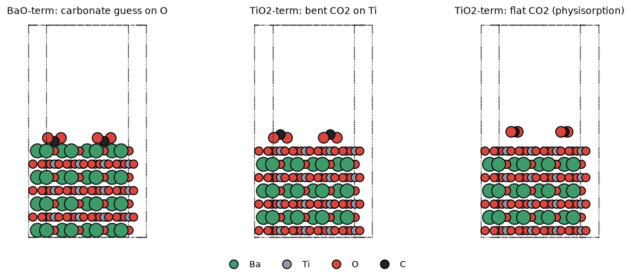
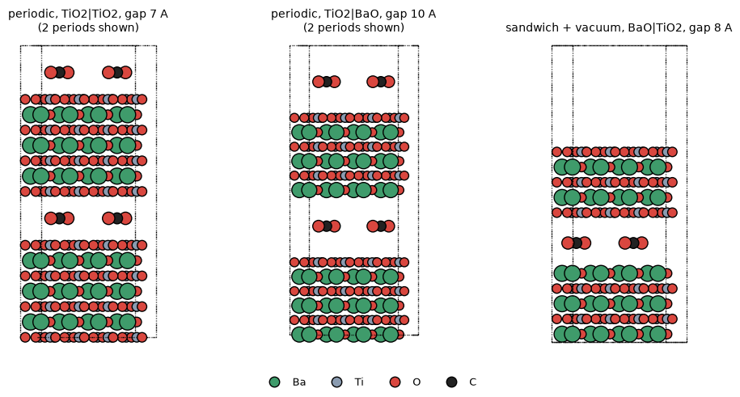
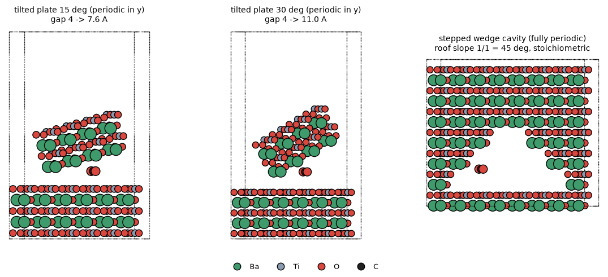
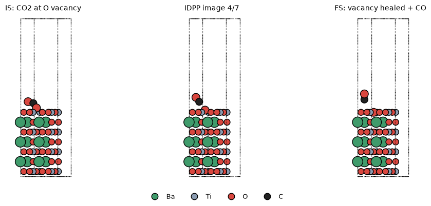

# BaTiO3 表面・細孔内の CO2 吸着 / CO2 解離 (CI-NEB) 計算キット — Quantum ESPRESSO 用

チタン酸バリウム (BaTiO3) の (001) 表面と、その表面でできた細孔 (スリット・楔形) に CO2 を置いた構造を作り、
Quantum ESPRESSO (pw.x / neb.x) の入力をまとめて生成するための Python (ASE) ツールです。

**結論: 全部できます。** ただし「斜めに置いたスラブの隙間」だけは、周期境界条件の制約から
そのままでは作れないので、下記 2.3 の 2 通りのモデルで実現しています。
また CO2 → CO + 1/2 O2、CO2 → C + O2 は 1 本の NEB では扱えないので、素過程に分けて CI-NEB します (3 章)。

| やりたいこと | このキットでのモデル | コマンド |
|---|---|---|
| 表面吸着 | (001) スラブ (BaO 終端 / TiO2 終端) + CO2 をサイト × 向きで網羅 | `surface` |
| 細孔 (平行スラブで挟む) | スリット細孔: 周期積層型 (真空なし) / サンドイッチ型 (真空あり) | `slit` |
| 細孔 (斜めのスラブの隙間) | 楔形細孔: ①傾斜プレート型 ②階段状キャビティ型 | `wedge-plate`, `wedge-step` |
| 解離反応 | R1–R5 の始状態・終状態 → IDPP 補間 → neb.x (CI-NEB) | `neb-endpoints`, `neb` |



---

## 1. 準備

```bash
pip install ase numpy scipy matplotlib        # ASE >= 3.23
# Quantum ESPRESSO 7.1 以降を推奨 (DFT+U の HUBBARD カード書式のため)。
#   例: conda install -c conda-forge qe
```

擬ポテンシャルは既定で **SSSP efficiency** のファイル名を使います (`btoco2/qe.py` の `PSEUDOS_SSSP`)。
お手元のバージョンのファイル名と違っていたらそこを書き換えてください。
SSSP が無い場合は pslibrary 1.0.0 の PAW を `ld1.x` で生成できます:

```bash
bash tools/make_pslibrary_paw.sh pseudo       # Ba, Ti, O, C を pseudo/ に生成
python make_inputs.py ... --pseudo-set psl    # この場合カットオフ既定値は 55/600 Ry
```

> 注意: pslibrary 1.0.0 の Ti.spn は ecutrho ≈ 575 Ry が必要です。ecutrho が低すぎると
> "negative rho" が ~1 電子出て SCF が収束しません (実際にテストで確認しました)。

---

## 2. 構造モデル

共通の約束:
- ペロブスカイトを層ごとに積み上げて作ります (BaO 層: Ba(0,0) O(½,½) / TiO2 層: Ti(½,½) O(½,0) O(0,½))。
- 格子定数 `--a` は **自分の汎関数で vc-relax した値** に置き換えてください (`refs` で bulk の vc-relax 入力を出します。PBE で ~4.03 Å、PBEsol で ~4.00 Å)。
- 立方晶 (常誘電) を基準にしています。強誘電分極の影響は 8 章。
- 各計算ディレクトリに `pw.in`, `structure.extxyz` (タグ・固定原子・吸着分子フラグ付き), `meta.json` (参照系) ができます。

### 2.1 表面 (`surface`)

- 7 層対称スラブ (TiO2 終端: TiO2/BaO/…/TiO2、BaO 終端: BaO/TiO2/…/BaO)、2×2 (CO2 被覆率 1/4 ML)、真空 20 Å、下 3 層固定、双極子補正あり。
- 吸着サイトは自動抽出: `top_X` (最表面原子の直上), `bridge_X-Y` (面内最近接の中点), `hollow_X` (第 2 層原子の直上)。
- CO2 の初期向き: `flat_x / flat_y / flat_diag` (寝かせる), `tilt45_x`, `upright`, `carbonate_*` (C を表面 O に向けた屈曲 CO2 = 炭酸塩型の初期構造、表面 O 上のみ), `bidentate_*` (両 O を表面に向けた屈曲 CO2、陽イオン上のみ)。
- `--random N` で表面上のランダム配置も追加できます (初期構造依存性のチェック用)。

目安として、BaO 終端は表面 O が塩基性で CO2 が表面 O と結合した炭酸塩 (CO3) 型の化学吸着になりやすく、
TiO2 終端は比較的弱い吸着 (物理吸着〜Ti 上の単座/二座) になりやすい、というのが一般的な描像です。
どちらになるかは初期構造にも依存するので、上記の網羅的な初期構造から緩和して最安定を選んでください。

### 2.2 スリット細孔 — 平行なスラブで CO2 を挟む (`slit`)



| 型 | 中身 | 長所 | 注意 |
|---|---|---|---|
| **periodic** (既定) | 1 枚のスラブ + gap。スラブ上面と「周期像の下面」が細孔壁。真空なし | 原子数が最小。双極子補正不要 (使ってはいけない) | 壁は同じスラブの上下面。層数が偶数なら TiO2 壁と BaO 壁が向かい合う |
| **sandwich** | 独立な 2 枚のスラブ + 真空 | 上下の壁の終端・ずれを自由に選べる | 原子数が多い。双極子補正あり |

- `gap` は向かい合う原子面どうしの距離。CO2 が実際に使える幅はおおよそ `gap − 3 Å` (O の vdW 半径 ×2)。CO2 の動的直径は 3.3 Å なので、`--gaps 6 7 8 10 12` のように振ると「閉じ込めの強い領域 → 表面とほぼ同じ領域」まで追えます。
- `--offsets 0.5` で上の壁を (½a, ½a) ずらせます (セルの c ベクトルを傾けて実装)。
- 偶数層 + gap = a/2 + ずれ 0 でバルク BaTiO3 に戻ることをテストで確認しています (= 結晶に入った亀裂を開いたモデル)。
- 細孔中の吸着エネルギーは **同じセルの空の細孔** を参照にします:
  `E_ads = E(細孔+CO2) − E(空の細孔) − E(CO2 気相)` (`empty/` が自動で作られます)。
- 生成される配置: 細孔中央 (`mid_*`)、下の壁に吸着 (`bottom_*`)、壁が異なる場合は上の壁に吸着 (`top_*`)。

### 2.3 斜めに置いたスラブの隙間 — 楔形細孔 (`wedge-plate`, `wedge-step`)

**なぜそのままでは作れないか:** 3 次元周期セルの中で、傾いた無限平面 (スラブ) は必ず相手のスラブ
(またはその周期像) と交差してしまいます。平行でない 2 枚の無限平面は必ずどこかで交わるからです。
そこで「交線 (楔の頂点) の近く」を切り出すモデルを 2 種類用意しました。



**① 傾斜プレート型 `tilted_plate_wedge`** (上図左・中)
- 下は普通の周期スラブ。上は **有限幅のプレート (リボン)** を y 軸 (楔の稜線) まわりに角度 θ 傾けて置きます。プレートは y 方向にだけ周期的で、x 方向は周期像と 8 Å 以上の真空で隔てます。
- 局所ギャップ `gap(x) = apex_gap + (x − x_apex)·tanθ` が 1 つの計算の中で連続的に変わるので、CO2 を楔に沿って何か所か置けば「幅の違う細孔」を一度に比べられます (`--npos`)。
- プレートは外側の層を固定し、細孔側の 2 層だけ緩和します。**傾き角は物理的な平衡ではなく、課した境界条件**です (全部自由にするとプレートが下に倒れるだけ)。
- 欠点: プレートの端 (エッジ) がある。CO2 はエッジから離れた位置に置き、プレート幅を変えて結果が変わらないか確認してください。

**② 階段状キャビティ型 `stepped_wedge`** (上図右)
- 完全周期の結晶から **BaTiO3 の単位ブロック (5 原子, 電気的中性) を丸ごと抜いて** 楔形の空洞を作ります。天井が階段状 (テラス幅 `terrace` 個に対し段差 1 個) なので平均傾斜は atan(1/terrace) = 45°, 26.6°, 18.4°, …。
- 化学量論・電気的中性が自動的に保たれ、エッジも真空も双極子補正も不要。`--profile V` は両端に楔の先端を持つテント形、`sawtooth` は片側だけ。`--h0 0` で先端が閉じた本物の頂点になります。
- 欠点: 壁が原子スケールの段差面 (ステップ) になる。角度が離散的。

①は「平らな面を斜めに置く」という発想にいちばん忠実、②は周期境界条件と化学量論の面でいちばんクリーン、という関係です。
両方で同じ傾向が出れば、それはエッジや段差のアーティファクトではない、という確認にも使えます。
同じ局所幅のスリット細孔 (2.2) と比べれば、「幅の効果」と「楔 (角・先端) の効果」を分けられます。

### 2.4 計算規模の目安 (CO2 込み)

| モデル | 原子数 | 価電子数 | k 点 (自動) |
|---|---:|---:|---|
| 表面 TiO2 終端 7 層 2×2 | 75 | 592 | 4×4×1 |
| 表面 BaO 終端 7 層 2×2 | 71 | 560 | 4×4×1 |
| 表面 TiO2 終端 7 層 3×3 (1/9 ML) | 165 | 1312 | 2×2×1 |
| スリット periodic 7 層, gap 8 Å | 75 | 592 | 4×4×1 |
| スリット sandwich 5+5 層, gap 8 Å | 107 | 848 | 4×4×1 |
| 傾斜プレート 20° (幅 4, 4 層 / 下地 5 層) | 239 | 1904 | 1×4×1 |
| 傾斜プレート 20° (幅 3, 3 層 / 下地 4 層) | 145 | 1152 | 1×4×1 |
| 階段状 V, terrace 1, nx 6, wall 2 | 243 | 1936 | 1×4×1 |
| 階段状 V, terrace 1, nx 8, wall 3 | 443 | 3536 | 1×4×1 |

表面・スリットは普通のクラスタ計算機で 1 構造あたり数時間程度の規模、楔形 (150〜450 原子) は QE だと重めです
(複数ノード + `-nk`/`-nd` 並列、まずは小さい方の設定で傾向をつかむのがおすすめ)。

---

## 3. 解離反応の CI-NEB (`neb-endpoints`, `neb`)

NEB は「同じ原子の組で、2 つの極小点をつなぐ」計算なので、全体反応を素過程に分けます。

| 記号 | 素過程 | 意味 |
|---|---|---|
| **R1** | CO2* + V_O → CO* + O(格子) | 表面酸素欠陥を CO2 の O が埋め、CO が残る。**CO2 → CO 変換で最も現実的な経路** |
| R2 | CO2* → CO* + O* | 欠陥のない表面での C–O 切断。O* は TiO2 終端では Ti 上、BaO 終端では表面 O 上 (過酸化物) |
| R3 | CO* → C* + O* | CO → C の第 2 段 |
| R4 | O* + O* → O2* | 酸素の再結合 (その後 O2 脱離) |
| R5 | CO2* → C* + O2* (協奏的) | 比較用。非常に高い障壁が予想される |

- **CO2 → CO + ½O2** = R2 → R4 (+ O2 脱離)、あるいは R1 (欠陥がある場合)。「½O2」は 1 つの NEB 像にできないので、
  エネルギー収支は気相の参照計算 `E(CO) + ½E(O2) − E(CO2)` と組み合わせて評価します (`analyze` が表示します)。
  実験値 ΔH ≈ +2.9 eV。PBE は O2 の結合を過大評価するので、O2 を含む反応エネルギーは補正 (例: H2O/H2 を参照にする) を検討してください。
- **CO2 → C + O2** = R2 → R3 → R4 (または R5)。気相では C(黒鉛) + O2 まで +4.1 eV と非常に吸熱的で、欠陥のない表面で起こる素過程とは考えにくいです。計算はできますが、R1 (欠陥) を主、R3/R5 を「どれだけ難しいかの確認」と位置づけるのがよいと思います。
- R1 は中性の酸素欠陥 (2 電子が Ti に残る) を含むので **スピン分極** で計算します (`--u 3.0` で Ti-3d に DFT+U も付けられます)。R3〜R5 も C 原子や O2 (三重項) を含むのでスピン分極にしてあります。



手順:

```bash
python make_inputs.py neb-endpoints --term TiO2 BaO          # runs/neb/R*/IS, FS (+ 参照スラブ)
# 1) IS と FS を pw.x で緩和 (各ディレクトリで pw.x -in pw.in > pw.out)
#    R2/R5 の IS は仮のもの。表面スクリーニングで一番安定だった構造に差し替えるのが本来の手順です。
# 2) 緩和済み構造から IDPP 補間で neb.x 入力を作る
python make_inputs.py neb --is runs/neb/R1_vac_TiO2/IS --fs runs/neb/R1_vac_TiO2/FS --nimages 7
cd runs/neb/R1_vac_TiO2/neb && mpirun -np 64 neb.x -nk 2 -in neb.in > neb.out
# 3) エネルギープロファイル
python make_inputs.py plot-neb runs/neb/R1_vac_TiO2/neb
```

CI-NEB のコツ:
- 像の数は 7〜9。まず `--ci no-CI --path-thr 0.3` で大まかな経路を作り、`restart_mode='restart'` と `CI_scheme='auto'` に書き換えて `path_thr 0.05` まで詰めると安定です。
- 途中の像が IS/FS より低くなったら、そこに中間体があります。その像を緩和して経路を 2 本に分割してください。
- 固定原子は FIRST_IMAGE の `0 0 0` が全像に適用されます (neb.x の仕様)。

---

## 4. 推奨計算条件 (既定値)

| 項目 | 既定値 | コメント |
|---|---|---|
| 汎関数 / vdW | PBE + D3(BJ) (`vdw_corr='dft-d3'`, `dftd3_version=4`) | CO2 の物理吸着・細孔内の閉じ込めは分散力が支配的。`--vdw rev-vdw-df2` や `rvv10` も可 |
| カットオフ | SSSP: 50 / 400 Ry, pslibrary: 55 / 600 Ry | 吸着エネルギーで収束確認を |
| k 点 | `n_i = round(28 Å / |a_i|)`、真空方向・細孔横断方向は 1 | 2×2 スラブで 4×4×1 |
| スメアリング | Marzari–Vanderbilt 0.01 Ry | 欠陥系・スラブの安定化のため |
| 双極子補正 | 真空のあるモデルで自動 ON (のこぎり波を真空の中央に自動配置) | periodic スリット・階段状キャビティは真空が無いので OFF |
| SCF | `mixing_mode='plain'`, β = 0.3 | 5 層スラブのテストで plain は 25 反復で収束、`local-TF` は 65 反復以上かかるか停滞したため plain を既定にしています。収束しにくければ β を 0.1〜0.2 に、`mixing_ndim` を 12〜16 に |
| 固定 | 表面: 下 3 層、スリット: 中央層、楔: 外側層 | |
| スピン | 欠陥・C・O2 を含む NEB 端点のみ ON | O2 気相は `tot_magnetization = 2` |

---

## 5. 実行手順 (まとめ)

```bash
python make_inputs.py refs                                   # CO2/CO/O2 気相 + bulk vc-relax
#   → bulk の a を確認して、以降は --a <値> を付ける
python make_inputs.py surface --a 4.03 --term TiO2 BaO --png
python make_inputs.py slit    --a 4.03 --term TiO2 BaO --gaps 6 7 8 10 12
python make_inputs.py slit    --a 4.03 --mode sandwich --term BaO --face-top TiO2 --gaps 8
python make_inputs.py wedge-plate --a 4.03 --angles 10 20 30
python make_inputs.py wedge-step  --a 4.03 --terrace 1 2 --nx 6 --wall 2
python make_inputs.py neb-endpoints --a 4.03 --term TiO2 BaO

# (推奨) まず空のスラブ / 空の細孔だけを緩和
cd runs/surface/TiO2_7L_2x2/empty && mpirun -np 32 pw.x -nk 4 -in pw.in > pw.out; cd -
# 緩和済みの基板の上に CO2 配置を作り直す → runs/surface/TiO2_7L_2x2_relaxed/
python make_inputs.py from-relaxed runs/surface/TiO2_7L_2x2 runs/slit/periodic_TiO2_7L_g8.0

# 各配置ディレクトリで (例)
cd runs/surface/TiO2_7L_2x2_relaxed/top_Ti__flat_x && mpirun -np 32 pw.x -nk 4 -in pw.in > pw.out

python make_inputs.py analyze runs                            # E_ads 一覧 + runs/summary.csv
```

**緩和済み基板から始める (`from-relaxed`)**:
切り出したままのスラブは表面層が大きく緩和します (テストでは最表面 Ti に 2.7 eV/Å の力)。
CO2 を置いた数十通りの配置それぞれでこの表面緩和をやり直すのは無駄なので、

1. `empty/` (CO2 なしの基板) だけを先に緩和し、
2. `from-relaxed <セットのディレクトリ>` で、`empty/pw.out` の最終構造の上に CO2 配置を作り直します。

- 出力は `<セット>_relaxed/` (元の結果は上書きしません。`--dest` で変更可)。
- 表面 (`surface`)・スリット・楔形のどのセットにも使えます。CO2 の高さは緩和後の表面層 (平均 z) を基準に置き直し、スリットは緩和後の壁間距離で細孔中央を計算し直します。
- カットオフ・擬ポテンシャル・vdW は元のセットと同じものを自動で使います。緩和済み `empty/pw.out` を新しいセットにコピーするので、吸着エネルギーの参照を計算し直す必要はありません。
- 既定では元のセットにあった配置だけを作り直します (`--all` で全配置、`--orient` / `--sites` / `--random` で絞り込み・追加)。
- `empty` の緩和が収束していないと止まります (`--allow-unconverged` で強制可)。

配置が多すぎる場合は `--orient flat_x carbonate_x` や `--sites top_O hollow` で絞れます。
効率よく探索したい場合は、低カットオフ・Γ 点で全配置を粗く緩和 → エネルギーの低い数個だけ本番条件で再緩和、が現実的です
(機械学習ポテンシャル MACE-MP / CHGNet などで事前緩和する手もあります。`structure.extxyz` をそのまま ASE で読めます)。

Python から直接使う場合:

```python
from btoco2 import make_slab, surface_sites, surface_configurations, tilted_plate_wedge, wedge_configurations
from btoco2.qe import write_pw

slab = make_slab(a=4.03, nlayers=7, top="BaO", size=(2, 2))
confs = surface_configurations(slab, surface_sites(slab))
write_pw("carbonate/pw.in", confs["top_O__carbonate_x"], pseudo_dir="../pseudo")

wedge = tilted_plate_wedge(a=4.03, angle=25, apex_gap=4.0, plate_width=4)
for name, atoms in wedge_configurations(wedge, n=4).items():
    write_pw(f"wedge25/{name}/pw.in", atoms, pseudo_dir="../../pseudo", kpts=(1, 4, 1))
```

---

## 6. 動作確認した内容

この環境 (4 コア) で本番計算までは回していませんが、以下は確認済みです:

- 構造: 全モデルで原子の重なりなし (最近接 ≥ Ti–O 距離)、組成・電気的中性、偶数層スリット + gap a/2 がバルクに一致、
  楔モデルの局所ギャップ、NEB 端点の原子順序の一致 → `python -m pytest tests` (16 テスト)。
- Quantum ESPRESSO 7.5 (conda-forge) + pslibrary 1.0.0 PAW で:
  - 気相 CO2 の緩和、O2 (三重項, `tot_magnetization=2`) の緩和が収束。
  - バルク BaTiO3 (立方晶, a = 4.00 Å): バンドギャップ 1.77 eV (PBE として妥当)。
  - 5 層 2×2 TiO2 終端スラブ + CO2 (55 atoms, D3 + 双極子補正, 2×2×1 k 点, 55/600 Ry) の relax:
    最初の SCF が 27 反復で収束 (双極子 0.24 D)、力が計算され BFGS が進むことを確認。
    SCF 混合は `local-TF` だと同じ系で収束が大幅に遅れた/停滞したので、既定を `plain` にしています (4 章)。
  - `neb.x` が 5 像の入力 (スピン分極 + DFT+U `HUBBARD {ortho-atomic}` + 双極子補正) を読み込み、初期経路長を計算して反復を開始することを確認。

---

## 7. 注意点・限界

- **強誘電分極**: 立方晶 (常誘電) を基準にしています。分極の向き (面直 上向き/下向き) で CO2 の吸着が変わりうるので、
  それを調べる場合は、固定層の Ti を ±z にずらした (正方晶の変位を入れた) スラブを作って比較してください。面直分極は反分極場の問題があるので、双極子補正と層数の収束確認が必須です。
- **7 層対称スラブは非化学量論** (例: Ti4Ba3O11)。吸着エネルギーは同じスラブを参照にするので問題ありませんが、表面エネルギーを出すときは化学ポテンシャルの扱いが必要です。偶数層にすると化学量論 (ただし上下で終端が違う) になります。
- 細孔モデルでは壁の一部を固定しているので、細孔内のエネルギーは拘束条件込みの値です。固定の仕方を変えて感度を見ると安心です。
- 初期構造依存性: 網羅的な初期配置 + ランダム配置で確認してください。
- 被覆率: 2×2 = 1/4 ML。低被覆の極限が欲しければ `--size 3 3`。

## 8. QE 以外の選択肢

QE で問題なく全部できます。参考までに:
- **VASP** (+ VTST tools): 表面吸着・NEB の事例が非常に多い。
- **CP2K**: 数百原子の楔形細孔のような大きな系・真空の多いセルでは、平面波より効率的なことが多い (GPW 法)。NEB もあり。
- **GPAW**: ASE と直結しているので、このキットの構造をそのまま使えます。

## ファイル構成

```
batio3_co2/
├── make_inputs.py          # CLI (入力生成・NEB 入力・解析・NEB プロット)
├── btoco2/
│   ├── slab.py             # バルク・(001) スラブ・吸着サイト
│   ├── co2.py              # CO2 の向き・配置・ランダム配置・気相分子
│   ├── pores.py            # スリット (periodic/sandwich)・傾斜プレート楔・階段状楔
│   ├── reactions.py        # R1–R5 の IS/FS、酸素欠陥、IDPP 補間
│   ├── qe.py               # pw.x / neb.x 入力ライター
│   └── viz.py              # プレビュー画像
├── tools/
│   ├── make_pslibrary_paw.sh   # pslibrary PAW を ld1.x で生成
│   └── wrap_upf_lines.py       # 長すぎる UPF 行の折り返し (新しい pw.x の読み込みエラー対策)
├── tests/test_builders.py
└── docs/ (make_figures.py, img/)
```
