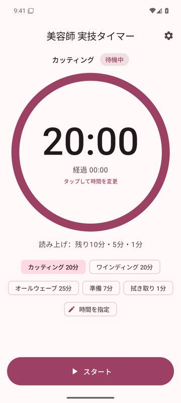
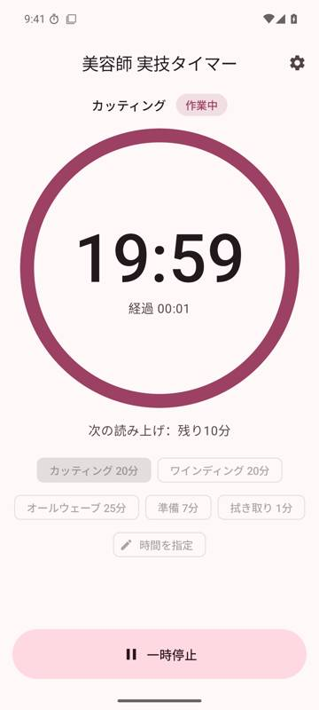
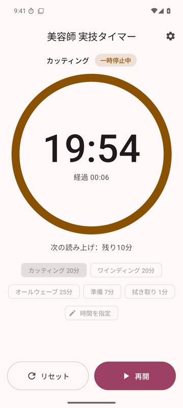
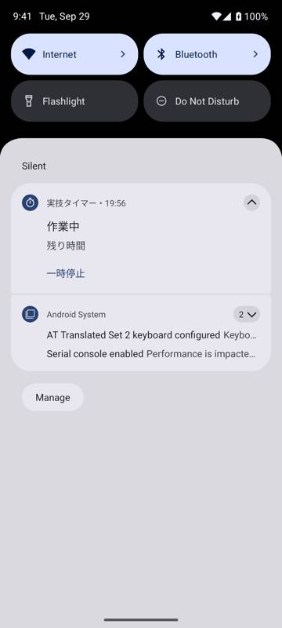
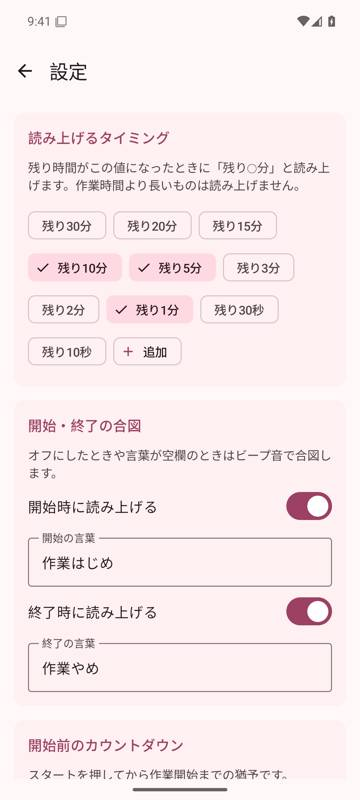

# 実技タイマー (Android)

美容師国家試験の実技練習用の音声タイマーです。iPhone 版しかない「山野タイマー」と同じように、
試験本番と同じタイミングで **「作業はじめ」「残り10分」「残り5分」「残り1分」「作業やめ」** を
音声で読み上げます。

> 学校法人山野学苑および「山野タイマー」とは関係のない、個人が作った練習用アプリです。

| 待機中 | 作業中 | 一時停止中 | 通知 (画面オフでも動作) | 設定 |
|:---:|:---:|:---:|:---:|:---:|
|  |  |  |  |  |

（Android 15 エミュレータでの画面）

## 主な機能

- **開始前の 3 秒カウントダウン**（ピッ・ピッ・ピッ → 「作業はじめ」）。なし / 3 / 5 / 10 秒から選べます
- **残り時間の読み上げ**：初期設定は残り 10 分・5 分・1 分。30 分〜10 秒の候補から選べ、好きな時間も追加できます
- **開始・終了の言葉**：「作業はじめ」「作業やめ」を自由に変更、またはビープ音に切り替え
- **プリセット**：カッティング 20 分 / ワインディング 20 分 / オールウェーブ 25 分 / 準備 7 分 / 拭き取り 1 分。
  時間は最大 99 分 59 秒まで自由に指定できます
- **一時停止・再開・リセット**（誤操作防止のため、作業中にリセットするには先に一時停止します）
- **画面が消えても動作**：通知に残り時間を表示し、ロック中でも読み上げを続けます
- 終了時のバイブレーション、作動中に画面を消さない設定、読み上げ速度の調整
- ダークモード・横画面対応。Android 8.0 以降で動きます

## インストール

1. GitHub の [Actions タブ](https://github.com/twatanabe1436-coder/Claude-cloud/actions/workflows/biyo-timer-android.yml)
   を開き、緑のチェックが付いた最新の実行を選びます。
2. ページ下部の **Artifacts** にある `biyo-timer-apk` をダウンロードし、zip を展開して `biyo-timer.apk` を取り出します
   （GitHub へのログインが必要です）。
3. APK を Android 端末に送ってタップします。「提供元不明のアプリ」の確認が出たら、そのアプリからのインストールを許可してください。
4. 初回起動時に「通知の許可」を求められたら **許可** を選びます（画面を消しているときに残り時間を通知に表示するため）。

`biyo-timer-v1.0.0` のような名前のタグを push すると、APK を添付した GitHub Release も自動で作られます
（Release のページからは zip ではなく APK を直接ダウンロードできます）。

> 同じ端末に上書きインストールできるのは、同じビルド環境で署名された APK だけです。
> 「アプリをインストールできませんでした」と出た場合は、古いほうをアンインストールしてから入れ直してください。

## 日本語の読み上げ音声を用意する

読み上げには Android 標準の「テキスト読み上げ」を使います。多くの端末ではそのまま日本語で話しますが、
アプリ上部に「日本語の読み上げ音声が使えないため、ビープ音でお知らせします」と出る場合は次を確認してください。

1. Play ストアで **「Google 音声サービス」(Speech Services by Google)** をインストール／更新する
2. 端末の設定 →「システム」→「言語」→「テキスト読み上げの出力」（機種により場所が異なります）で、
   優先するエンジンを **Google** にする
3. 同じ画面の歯車 →「音声データのインストール」から **日本語** をダウンロードする

アプリの 設定 → 音声 にある「音声データを入手」「読み上げの設定」ボタンからも開けます。
「テスト再生」で「残り10分」と聞こえれば準備完了です。音量は **メディアの音量** に従います。

## 使い方

1. プリセット（例：カッティング 20 分）を選ぶか、円のタイマー部分をタップして時間を入力します
2. **スタート** を押すと 3 秒のカウントダウンのあと「作業はじめ」で計測が始まります
3. 残り時間に応じて「残り10分」「残り5分」「残り1分」と読み上げ、時間になると「作業やめ」と言って止まります

プリセットの時間は一般的な実技試験の目安です。受験する年度の実施要項もあわせて確認してください。

## 開発者向け

- Kotlin + Jetpack Compose (Material 3)、Android Gradle Plugin 9.2、minSdk 26 / targetSdk 36
- `app/src/main/java/.../timer/` … Android に依存しないタイマー本体（`ExamTimer`）と設定。ユニットテストあり
- `app/src/main/java/.../runtime/` … 読み上げ（TextToSpeech＋ビープ音）、フォアグラウンドサービス、設定の保存
- `app/src/main/java/.../ui/` … 画面（タイマー・設定）

```sh
cd biyo_timer
./gradlew testDebugUnitTest          # ユニットテスト
./gradlew assembleRelease            # app/build/outputs/apk/release/app-release.apk
./gradlew connectedDebugAndroidTest  # 端末/エミュレータでの UI テスト
```

GitHub Actions（`.github/workflows/biyo-timer-android.yml`）が push のたびにユニットテスト・lint・APK ビルドを行います。
Actions の画面から手動実行（Run workflow）すると、Android 8.0 と 15 のエミュレータで UI テストも行います。
