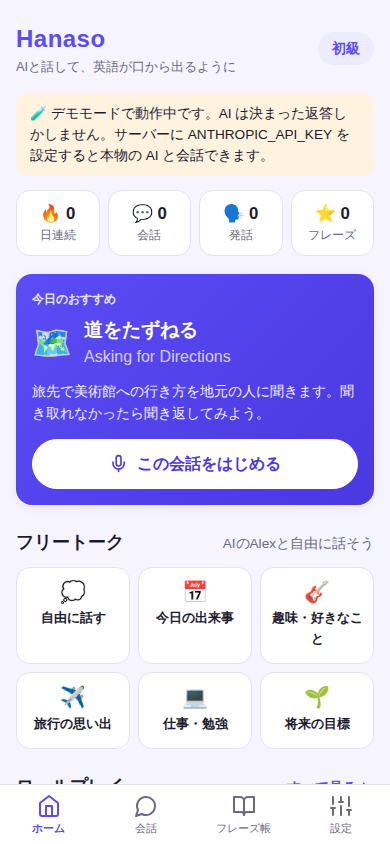
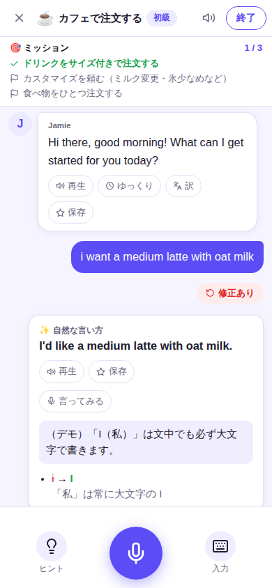

# Hanaso（はなそ）— AIと声で話す英会話アプリ

「AI英会話スピーク（Speak）」のように、**AI と声でやりとりしながら英語を話す練習をする**ための Web アプリです。
単語やクイズが中心のアプリ（Epop など）で覚えた表現を、**実際の会話で口から出す練習**に使うことを想定しています。

スマホのブラウザで動き、ホーム画面に追加すればアプリのように使えます（PWA）。AI には Claude API を使っています。

<p>
  
  
  
  
</p>

## できること

| 機能 | 内容 |
| --- | --- |
| 🎤 **音声で会話** | マイクボタンを押して英語で話すと、AI が役になりきって返事をし、声で読み上げます。返事は届いたそばから文単位で読み上げるので、待ち時間が短く感じられます。 |
| 🎭 **ロールプレイ（12種類）** | カフェ・道案内・レストラン・入国審査・ホテル・返品・パーティー・週末の予定・病院・同僚との雑談・会議・英語面接。初級〜上級。 |
| 🎯 **ミッション** | 各シナリオに「サイズを指定して注文する」などの目標があり、会話の中で達成すると自動でチェックが付きます。 |
| 💬 **フリートーク** | 会話相手の Alex と「今日の出来事」「趣味」「旅行」などのテーマで自由に話せます。 |
| ✏️ **発話ごとのフィードバック** | 話すたびに AI コーチが「Great!／もっと自然に／修正あり」を判定し、正しい文・ネイティブらしい言い方・日本語の解説を表示します。 |
| 💡 **ヒント** | 詰まったら、次に言えることを3パターン（シンプル・自然・会話を進める）提案します。 |
| 🇯🇵 **日本語で言いたいこと → 英語** | 日本語で入力すると「英語ではこう言う」を提案します。提案を見ながら**自分の声で言う**練習ができます。 |
| 🔁 **言ってみる（発音チェック）** | お手本の文を言うと、どの単語が言えたかを色分けして採点します。 |
| 🎧 **ハンズフリー会話** | AI が話し終わると自動でマイクが ON になり、電話のように会話が続きます。 |
| 👂 **聞き取りモード** | AI のセリフを隠して、耳だけで聞き取る練習ができます（タップで表示）。 |
| 📝 **振り返り** | 会話の最後にスコア・よかった点・伸ばしたいポイント・覚えたいフレーズを表示します。 |
| ⭐ **フレーズ帳** | 気に入った表現を保存して、発音チェックや「日本語→英語」のフラッシュカードで復習できます。 |
| 🔥 **記録** | 連続日数・会話回数・発話数を記録します（データは端末のブラウザ内に保存）。 |

## 使い方（ローカルで起動）

Node.js 20 以上が必要です。

```bash
cd hanaso
npm install
cp .env.example .env      # .env を開いて ANTHROPIC_API_KEY を設定
npm start                 # → http://localhost:3000
```

- API キーは [Anthropic Console](https://console.anthropic.com/) で発行できます。
- **API キーがなくても `npm run demo` で「デモモード」**として起動し、画面や音声入力の流れを試せます（AI は決まった返答しかしません）。
- ブラウザは **Chrome（PC / Android）か Safari（iPhone / Mac）** を使ってください。Firefox は音声認識に対応していないため、キーボード入力のみになります。

## スマホで使うには

ブラウザのマイク（音声認識）は **HTTPS か localhost でしか動きません**。スマホから使うには次のどちらかにしてください。

1. **サーバーにデプロイする**（おすすめ）: Render / Railway / Fly.io などの Node.js が動くサービスに `hanaso/` をデプロイし、環境変数 `ANTHROPIC_API_KEY` と **`APP_PASSCODE`（合言葉）** を設定します。起動コマンドは `npm start` です。
2. **PC で起動してトンネルを使う**: `npx cloudflared tunnel --url http://localhost:3000` などで HTTPS の URL を発行し、スマホで開きます。

開いたら、iPhone は共有メニューの「ホーム画面に追加」、Android は「アプリをインストール」でアプリのように使えます。

> ⚠️ インターネットに公開するときは **必ず `APP_PASSCODE` を設定**してください。設定しないと、URL を知っている人が誰でもあなたの API キーで AI を使えてしまいます。

## 設定（環境変数）

| 変数 | 既定値 | 説明 |
| --- | --- | --- |
| `ANTHROPIC_API_KEY` | なし | Claude API キー。未設定ならデモモード |
| `CLAUDE_MODEL` | `claude-opus-5-5` | 使うモデル。速さ・料金重視なら `claude-sonnet-5-5` |
| `CLAUDE_EFFORT` | `low` | 会話・添削・ヒント・翻訳の思考の深さ（`low`/`medium`/`high`）。低いほど速い |
| `CLAUDE_SUMMARY_EFFORT` | `medium` | 振り返りの思考の深さ |
| `APP_PASSCODE` | なし | 設定すると、アプリを開くときに合言葉が必要になる |
| `AI_MODE` | 自動 | `mock` でデモモード、`claude` で Claude を強制 |
| `PORT` / `HOST` | `3000` / `0.0.0.0` | 待ち受けポート / アドレス |

### 料金の目安

1回話すごとに「返事」と「フィードバック」の2回 AI を呼びます（ヒント・翻訳・振り返りは使ったときだけ）。
会話が長くなるほど1回あたりの入力が増えるので、1回の会話は5〜15往復くらいで区切るのがおすすめです。
会話履歴はプロンプトキャッシュで再利用して入力コストを抑えています。料金を下げたい場合は `CLAUDE_MODEL=claude-sonnet-5-5` にしてください。

## しくみ

```
スマホのブラウザ                                  サーバー (Node.js / Express)          Claude API
┌──────────────────────────────┐   /api/reply (NDJSON ストリーミング)  ┌───────────────┐
│ 音声認識 (Web Speech API)     │ ─────────────────────────────▶ │ 会話相手       │ ──▶ 役になりきった返事
│  → テキスト                   │   /api/feedback (JSON)          │ 添削コーチ     │ ──▶ 構造化出力 (JSON)
│ 返事を文ごとに読み上げ        │ ◀───────────────────────────── │ ヒント / 翻訳  │
│ (speechSynthesis)            │   /api/hint /translate /summary │ 振り返り       │
│ フレーズ帳・記録は localStorage│                                 └───────────────┘
└──────────────────────────────┘
```

- **音声認識・読み上げはブラウザの機能**（Web Speech API）を使うので、追加の料金はかかりません。
- 返事はストリーミングで受け取り、文が完成するたびに読み上げを始めます。フィードバックは返事と並行して取得します。
- フィードバック・ヒント・翻訳・振り返りは Claude の構造化出力（JSON スキーマ）で受け取ります。
- AI の安全フィルターで応答が止まった場合は、サーバー側フォールバック（`fallbacks: "default"`）で推奨モデルに自動で切り替えます。
- API キーはサーバー側だけで使い、ブラウザには渡しません。

### ファイル構成

```
hanaso/
├── server/
│   ├── index.js          起動・環境変数
│   ├── app.js            API ルーティング (Express)
│   ├── scenarios.js      シナリオ・フリートークのデータ
│   └── ai/
│       ├── claude.js     Claude API を呼ぶエンジン
│       ├── mock.js       デモモード用のエンジン
│       ├── prompts.js    プロンプト
│       ├── schemas.js    構造化出力と入力検証のスキーマ (zod)
│       └── errors.js     エラーの分類と日本語メッセージ
├── public/               画面 (ビルド不要の素の JavaScript)
│   ├── js/main.js        起動・画面遷移
│   ├── js/views/         ホーム・会話・振り返り・フレーズ帳・設定
│   ├── js/speech.js      音声認識・読み上げ
│   ├── js/text.js        文分割・発音採点
│   └── css/app.css
└── test/                 単体テスト・API テスト・E2E テスト
```

### シナリオを追加するには

`server/scenarios.js` の `SCENARIOS` に1件追加するだけです。`aiRole`（AI の役）・`setting`（場面）・`opener`（最初のセリフ）・`missions`（ミッション）・`keyPhrases`（使えるフレーズ）を書いてください。

## テスト

```bash
npm test          # 単体テスト・API テスト (AI は呼ばない)
npm run e2e       # ブラウザで主要な流れを通しで確認 (要 Playwright / Chromium)
```

E2E テストでは音声認識・読み上げを偽物に差し替えて、マイク入力 → 自動送信 → 返事の読み上げ → 添削 → ハンズフリー会話 → 振り返り → フレーズ帳まで確認します。

## 今後の拡張アイデア

- 高品質な音声（OpenAI / ElevenLabs などの TTS、Whisper などの STT）への差し替え
- 音声の波形から発音・イントネーションを評価する本格的な発音判定
- アカウントとクラウド同期（複数端末で記録を共有）
- 学習履歴から苦手な表現を出題する復習（間隔反復）
- React Native / Expo によるネイティブアプリ化
