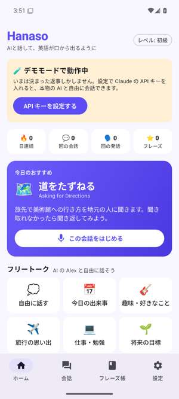

# Hanaso（はなそ）英会話 — Android アプリ

「AI英会話スピーク（Speak）」のように、**AI と声でやりとりしながら英語を話す練習をする** Android アプリです。
単語やクイズが中心のアプリ（Epop など）で覚えた表現を、**実際の会話で口から出す練習**に使うことを想定しています。
AI には Claude API を使い、スマホから直接呼び出します（サーバーは不要）。

| ホーム | 会話と添削 | ヒント | 振り返り | ハンズフリー |
|:---:|:---:|:---:|:---:|:---:|
|  |  |  |  |  |

（Android 15 エミュレータ・デモモードでの画面）

## できること

| 機能 | 内容 |
| --- | --- |
| 🎤 **声で会話** | マイクボタンを押して英語で話すと、AI が役になりきって返事をし、声で読み上げます。返事は届いたそばから文単位で読み上げます。 |
| 🎭 **ロールプレイ 12 種類** | カフェ・道案内・レストラン・入国審査・ホテル・返品・パーティー・週末の予定・病院・同僚との雑談・会議・英語面接（初級〜上級）。 |
| 🎯 **ミッション** | 「サイズを指定して注文する」などの目標が、会話の中で達成されると自動でチェックされます。 |
| 💬 **フリートーク** | AI の Alex と「今日の出来事」「趣味」「旅行」などのテーマで自由に話せます。 |
| ✏️ **発話ごとの添削** | 話すたびに「Great!／もっと自然に／修正あり」を判定し、正しい文・ネイティブらしい言い方・日本語の解説を表示します。 |
| 💡 **ヒント** | 詰まったら、次に言えることを 3 パターン提案します。**日本語で言いたいこと**を入れると英語の言い方を提案し、見ながら自分の声で言う練習ができます。 |
| 🔁 **言ってみる（発音チェック）** | お手本の文を言うと、言えた単語と言えなかった単語を色分けして採点します。 |
| 🎧 **ハンズフリー会話** | AI が話し終わると自動でマイクが ON になり、電話のように会話が続きます。 |
| 👂 **聞き取りモード** | AI のセリフを隠して耳だけで聞き取る練習（タップで表示）。 |
| 📝 **振り返り** | 会話の最後にスコア・よかった点・伸ばしたいポイント・覚えたいフレーズを表示します。 |
| ⭐ **フレーズ帳** | 表現を保存して、発音チェックや「日本語 → 英語」のフラッシュカードで復習できます。 |

Android 8.0 以降で動きます。ダークモード対応。

## インストール

1. **Android 端末のブラウザ**で次のリンクを開くと、APK が直接ダウンロードされます（GitHub へのログインは不要です）。

   **https://github.com/twatanabe1436-coder/Claude-cloud/releases/download/hanaso-v0.1.0/hanaso.apk**

   （[Releases ページ](https://github.com/twatanabe1436-coder/Claude-cloud/releases) の「Hanaso 英会話」からも入手できます）
2. ダウンロードした `hanaso.apk` をタップします。「提供元不明のアプリ」の確認が出たら、
   そのブラウザ（またはファイルアプリ）からのインストールを許可してください。
3. アプリを開き、最初に会話を始めるときに **マイクの使用を許可** してください。

> 実技タイマーと同じリポジトリなので、`releases/latest` のリンクはタイマーのままにしてあります。
> Hanaso は上のリンク（またはReleases 一覧）から入手してください。
> 新しい版を入れるときに「アプリをインストールできませんでした」と出た場合は、古いほうをアンインストールしてから入れ直してください。

## Claude の API キーを設定する

API キーがなくても **デモモード**（決まった返事のみ）で画面や音声の流れを試せます。本物の AI と話すには:

1. PC かスマホで [Claude Console](https://platform.claude.com/settings/keys) を開き、API キー（`sk-ant-…`）を発行します。
   （利用には Anthropic API のクレジットが必要です）
2. アプリの **設定 → Claude API キー** に貼り付けて「保存」し、「接続テスト」で確認します。

- キーは Android Keystore の鍵で**暗号化して端末内にだけ保存**され、Claude API との通信にだけ使われます（バックアップにも含まれません）。
- 1 回話すごとに「返事」と「添削」の 2 回 AI を呼びます（ヒント・翻訳・振り返りは使ったときだけ）。
  **設定 → AI モデル** で「速い・安い」（Claude Sonnet 5.5）にすると、返事が速くなり料金も下がります。既定は「高品質」（Claude Opus 5.5）です。
- 自分の端末で使うことを前提にしています。API キーを入れた端末を他人に渡さないでください。

## 音声認識・読み上げについて

- 音声認識は Android 標準の仕組み（通常は **Google アプリ**の音声認識）を使います。
  「この端末では音声認識が使えません」と出る場合は、Play ストアで Google アプリをインストール・更新してください。
- 読み上げは Android 標準の「テキスト読み上げ」を使います。英語の声が出ない場合は、**設定 → 音声** の
  「読み上げの設定を開く」「音声データを入れる」から英語（米国）の音声データを入れてください。
- 考えながら話すと途中で送信されてしまう場合は、**設定 → 会話モード → 話し終わりの待ち時間** を「長め」にするか、
  「話し終わったら自動で送信」をオフにしてください（認識した文を確認・修正してから送信できます）。

## しくみ

```
┌─ Android アプリ ─────────────────────────────┐
│ 音声認識 (SpeechRecognizer) → 英文              │         ┌──────────────┐
│ 返事を文ごとに読み上げ (TextToSpeech)           │ ──────▶ │  Claude API   │
│ 画面 (Jetpack Compose)                          │ ◀────── │              │
│ 記録・フレーズ帳 (端末内) / API キー (暗号化)    │         └──────────────┘
└─────────────────────────────────────────────┘
```

- 会話の返事はストリーミングで受け取り、文が完成するたびに読み上げます。添削は返事と並行して取得します。
- 添削・ヒント・翻訳・振り返りは Claude の構造化出力（Kotlin のクラスから JSON スキーマを自動生成）で受け取ります。
- AI の安全フィルターで応答が止まった場合は、サーバー側フォールバック（`fallbacks: "default"`）で推奨モデルに自動で切り替えます。
- Claude の呼び出しには公式 Java SDK（`com.anthropic:anthropic-java`）を使っています。

### ファイル構成

```
hanaso_android/
├── core/        Android に依存しない部分 (単体でビルド・テストできる Gradle ビルド)
│   └── src/main/kotlin/…/core/
│       ├── Catalog.kt       シナリオとフリートークのトピック
│       ├── Prompts.kt       プロンプト
│       ├── ClaudeEngine.kt  Claude API (ストリーミング・構造化出力・エラー分類)
│       ├── MockEngine.kt    デモモード
│       ├── Text.kt          文分割・発音採点
│       └── Model.kt / Stats.kt
└── app/         Android アプリ
    └── src/main/java/…/hanaso/
        ├── HanasoApp.kt     アプリ全体の状態・画面遷移
        ├── data/            設定・フレーズ帳・記録・API キーの保存
        ├── speech/          音声認識・読み上げ
        └── ui/              画面 (talk/ が会話画面)
```

### ビルド・テスト（開発者向け）

```bash
cd hanaso_android
./gradlew -p core test          # コアのテスト (Android SDK 不要)
./gradlew testDebugUnitTest     # アプリのユニットテスト
./gradlew assembleRelease       # APK (app/build/outputs/apk/release/)
./gradlew connectedDebugAndroidTest   # 実機・エミュレータでの UI テスト
```

GitHub Actions（`.github/workflows/hanaso-android.yml`）が push ごとに、コアのテスト・lint・APK のビルドと、
エミュレータ（Android 8.0 / 15）での UI テストを実行します。UI テストでは音声認識と読み上げを偽物に差し替え、
AI はデモモードで、会話 → 添削 → ミッション達成 → 振り返り → フレーズ帳 → ハンズフリー会話までを確認します。
また、端末上にテスト用サーバーを立てて、Claude SDK が Android 上で正しく動くこと（ストリーミング・構造化出力）も確かめます。

**新しい版を公開するには**: [Actions](https://github.com/twatanabe1436-coder/Claude-cloud/actions/workflows/hanaso-android.yml) から
ワークフローを手動実行して `release_version` に `0.1.1` のようなバージョンを入れるか、`hanaso-v0.1.1` のようなタグを push します。

### シナリオを追加するには

`core/src/main/kotlin/…/core/Catalog.kt` の `scenarios` に 1 件追加します。`aiRole`（AI の役）・`setting`（場面）・
`opener`（最初のセリフ）・`missions`（ミッション）・`keyPhrases`（使えるフレーズ）を書いてください。
