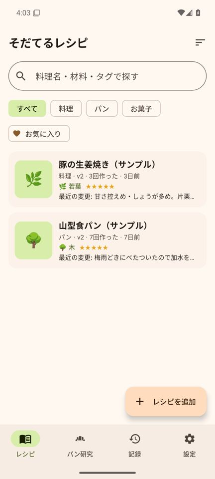
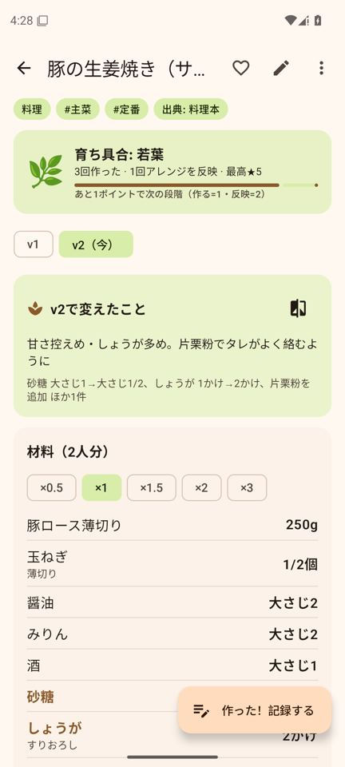
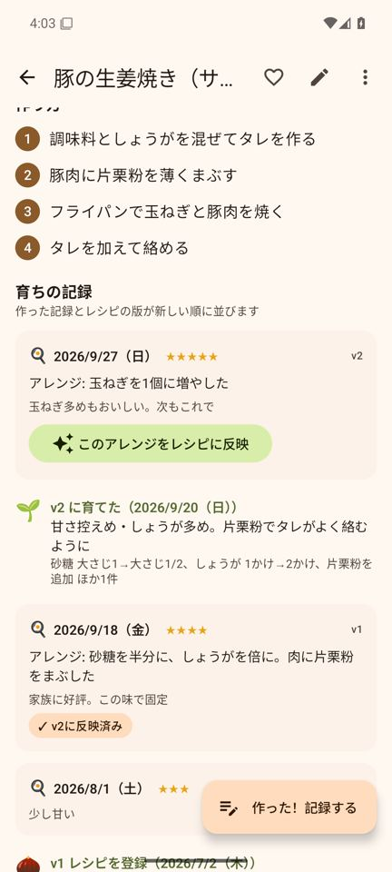
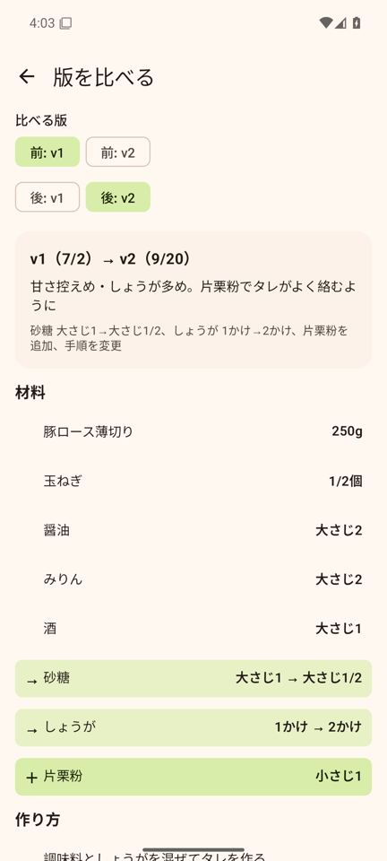
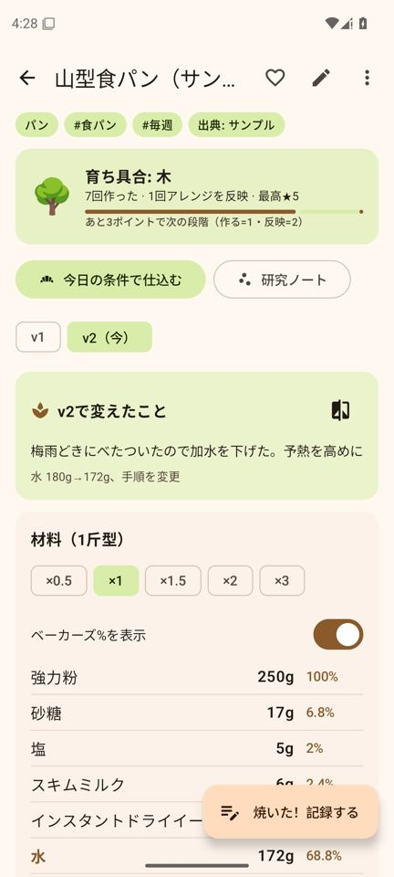
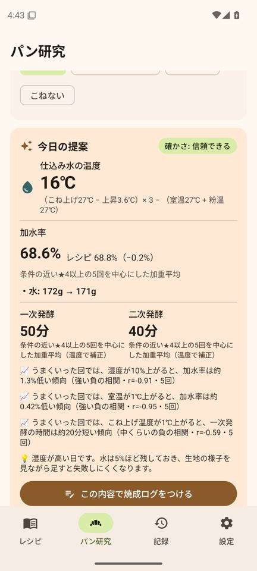
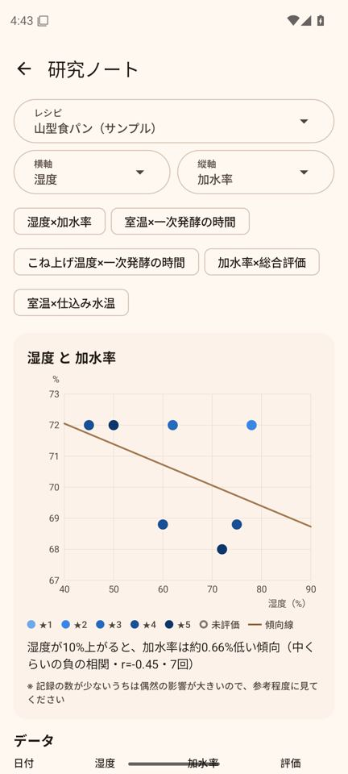
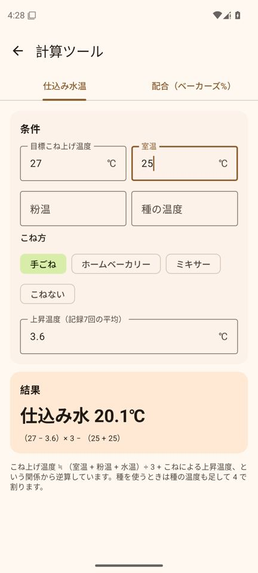

# そだてるレシピ (Android)

**レシピを「育てる」ノートアプリ**です。レシピを見て作る → 少しアレンジする → よかったらレシピに反映する、
という紙のノートでやっていた流れをそのままデジタルにしました。パンについては、室温・湿度などの条件と
配合・発酵時間・出来栄えを記録していくことで、**その日の条件に合わせた仕込みを提案する「パン研究」**を中心に据えています。

| レシピ一覧 | 詳細（育ち具合・変えたこと） | 育ちの記録 | 版の比較 |
|:---:|:---:|:---:|:---:|
|  |  |  |  |
| **パンのレシピ（ベーカーズ%）** | **パン研究（今日の提案）** | **研究ノート** | **計算ツール** |
|  |  |  |  |

（Android 15 エミュレータでの画面。サンプルデータを入れた状態）

## できること

### レシピを育てる
- **作った記録**: 作った日・★評価・アレンジしたこと・感想・写真を残す
- **レシピに反映**: 記録のアレンジを「新しい版 (v2, v3 …)」としてレシピに反映。古い版はそのまま残る
- **版の比較**: 材料の増減・量の変化 (例: 砂糖 大さじ2 → 大さじ1.5)・手順の違いを色分けで表示。
  詳細画面でも前の版から変えた材料は色付きで表示
- **育ちの記録**: 版と作った記録を時系列で並べたタイムライン。作るほど・反映するほど
  🌰たね → 🌱芽 → 🌿若葉 → 🌳木 → 🍎実り と育つ
- 分量の倍率 (×½〜×3)、お気に入り、検索、並び替え (最近作った順・よく作る順など)

### パン研究
- **焼成ログ**: 室温・湿度・粉温・天気、こね方・目標こね上げ温度・仕込み水温・こね上げ温度 (実測)、
  実際の配合、一次/二次発酵の時間と温度、焼成温度・時間、ふくらみ/内相/皮/味の評価
- **今日の提案**: 今日の室温・湿度を入れると、過去の焼成ログから
  - **仕込み水温** = (目標こね上げ温度 − 上昇温度) × 3 − (室温 + 粉温)
    - 上昇温度 (こねている間に生地が温まる分) は記録から**こね方ごとに自動で学習**
  - **加水率**: 条件が近く評価の高い回ほど重く見た加重平均。レシピとの差と、水を何 g にすればよいかも表示
  - **発酵時間**: 過去の回の時間を「温度 10℃ で発酵の速さ約 2 倍 (Q10 = 2)」の目安で今日の温度に補正
  - 条件が近かった過去の回、うまくいった回に見られる傾向 (例:「湿度が 10% 上がると加水率は約 1.6% 低い傾向」)
  - そのまま「この内容で焼成ログをつける」と、提案の値が入った記録画面が開く
- **研究ノート**: 室温・湿度・加水率・こね上げ温度・発酵時間・評価などから 2 項目を選んで散布図 (点の色は総合評価)
  と回帰直線・相関を表示
- **計算ツール**: 仕込み水温 (中種・ルヴァンなど種の温度にも対応)、ベーカーズ% (加水率の変更・粉の量・
  「◯個 × ◯g」への拡大縮小)

### 写真から読み取る (文字起こし)
- **端末内 (無料・オフライン)**: ML Kit の日本語モデルで読み取り、「材料」「作り方」「メモ」に自動で振り分け
- **Claude (高精度)**: 手書きのノートも読み取り、取り消し線や書き足しの修正も反映して振り分ける。
  利用者自身の Anthropic API キーを設定画面で入力して使う (従量課金。写真 1 枚でおおむね数円〜十数円)
- 作った記録の画面からは「ノートの写真から文字起こし」でアレンジ欄・感想欄に追加できる

### データの保存
- データはスマホの中 (SQLite) に保存。アカウント登録は不要
- 設定 → **バックアップを書き出す** で、レシピ・記録・写真を 1 つの .zip に。機種変更やアプリの入れ直しのときに読み込んで戻せる
- Android の自動バックアップ (Google ドライブ) にもレシピと記録は含まれる (写真と API キーは含まない)
- API キーは Android Keystore の鍵で暗号化して端末内に保存し、バックアップにも含めない

## インストール

1. **Android 端末のブラウザ**で次のリンクを開くと、APK が直接ダウンロードされます（GitHub へのログインは不要です）。

   **https://github.com/twatanabe1436-coder/Claude-cloud/releases/download/sodateru-latest/sodateru-recipe.apk**

2. ダウンロードした `sodateru-recipe.apk` をタップします。「提供元不明のアプリ」の確認が出たら、
   そのブラウザ（またはファイルアプリ）からのインストールを許可してください。
3. 最初の画面の「サンプルを入れて試してみる」で、食パンと生姜焼きのサンプルが入ります（設定画面から削除できます）。

Android 8.0 以降で動きます（iPhone にはインストールできません）。

### 署名鍵について（開発者向け・大事）

Android は **同じ鍵で署名された APK しか上書き更新できません**。鍵が変わった APK を入れるにはアンインストールが必要で、
**アンインストールするとアプリ内のデータ（レシピ・記録）も消えます**。
GitHub Actions の Secrets に次の 4 つを登録すると、毎回同じ鍵で署名されます（未登録のときはデバッグ鍵で署名し、警告が出ます）。

| Secret | 内容 |
|---|---|
| `SODATERU_KEYSTORE_BASE64` | keystore ファイルを base64 にしたもの |
| `SODATERU_KEYSTORE_PASSWORD` | keystore のパスワード |
| `SODATERU_KEY_ALIAS` | 鍵の別名 |
| `SODATERU_KEY_PASSWORD` | 鍵のパスワード |

keystore の作り方の例（JDK の `keytool` を使う）:

```sh
keytool -genkeypair -v -keystore sodateru.jks -alias sodateru -keyalg RSA -keysize 4096 -validity 36500
base64 -w0 sodateru.jks   # 出力を SODATERU_KEYSTORE_BASE64 に登録
```

鍵を切り替える前に入れていた版からは上書き更新できないので、その場合は **設定 → バックアップを書き出す** →
アンインストール → 新しい APK をインストール → **バックアップから読み込む** の順で移行してください。

### 新しい版を公開するには（開発者向け）

[Actions](https://github.com/twatanabe1436-coder/Claude-cloud/actions/workflows/sodateru-recipe-android.yml) から
ワークフローを手動実行 (Run workflow) して `release_version` に `1.0.1` のようなバージョンを入れるか、
`sodateru-v1.0.1` のような名前のタグを push すると、APK をビルドして Release を作ります。
上のダウンロードリンク（`sodateru-latest`）は常に最新の版を指します。
版を上げるときは `app/build.gradle.kts` の `versionCode` / `versionName` も上げてください。

## 開発者向け

- Kotlin + Jetpack Compose (Material 3)、minSdk 26 / targetSdk 36。ビルド構成は `biyo_timer/` と同じ
- `core/` … Android に依存しない計算・解析ロジック（Kotlin/JVM、別ビルド）。**Android SDK なしでビルド・テストできる**
  - `model/Models.kt` レシピ・版・記録・焼成ログのデータ構造
  - `Amounts.kt` 量の表記 (1/2, 1と1/2, 2〜3, 少々) の読み取り・拡大縮小・表示
  - `BakersMath.kt` ベーカーズ%・加水率・配合の拡大縮小、材料名からの役割 (粉・水分など) の推測
  - `DoughTemperature.kt` 仕込み水温の計算と、こね方ごとの上昇温度の学習
  - `BakeAdvisor.kt` 今日の提案（加水率・水温・発酵時間・似た回・傾向）
  - `BakeAnalysis.kt` / `Stats.kt` 研究ノートの項目・回帰直線・相関
  - `RecipeDiff.kt` 版の差分、`Growth.kt` 育ち具合、`DataCodec.kt` 保存形式とバックアップの結合
  - `RecipeTextParser.kt` 端末内 OCR の結果を材料・手順・メモに振り分け
  - `claude/ClaudeRecipeReader.kt` Claude API（公式 Java SDK、構造化出力）による写真の読み取り
- `app/` … 画面 (`ui/`)、保存 (`data/`: SQLite・写真・バックアップ・設定・API キー)、文字起こし (`ocr/`)
- `scripts/release_smoke.py` … リリース版 APK をエミュレータで操作する確認スクリプト (CI 用)

```sh
cd sodateru_recipe
./gradlew -p core test               # 計算・解析ロジックのユニットテスト (Android SDK 不要)
./gradlew assembleRelease            # app/build/outputs/apk/release/app-release.apk
./gradlew connectedDebugAndroidTest  # 端末/エミュレータでの UI テスト
```

GitHub Actions（`.github/workflows/sodateru-recipe-android.yml`）が push のたびにユニットテスト・lint・APK ビルドを行います。
Actions の画面から手動実行（Run workflow）すると、Android 8.0 と 15 のエミュレータで UI テスト（主要画面の操作・
端末内 OCR）と、リリース版 APK の動作確認（データの保存と読み戻し・Claude API のエラー処理）も行います。
